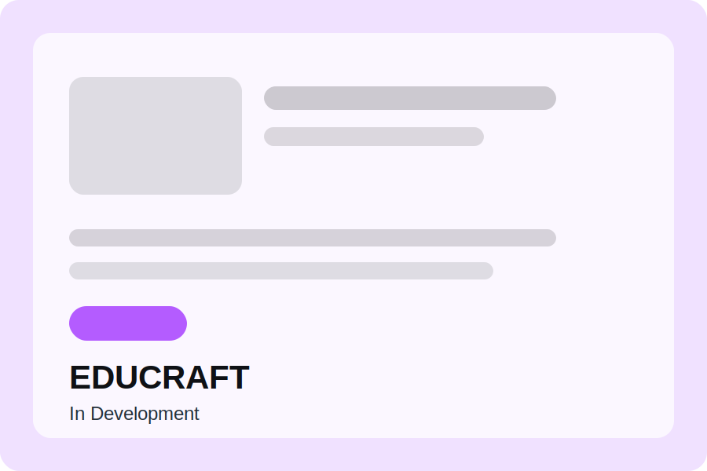
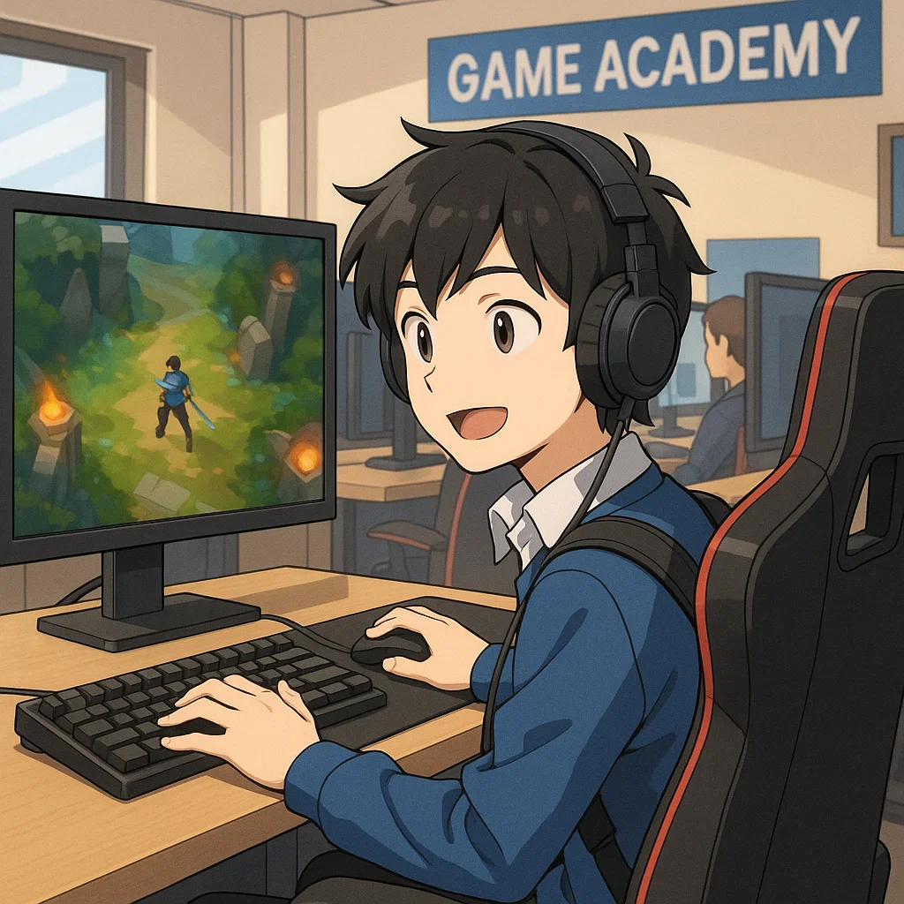

<section class="hero" id="hero">
  

    

      
    

    

      
콘텐츠 개발자 / 메타버스 개발자

      <h1>DOCU</h1>
      

      

      

        UNITY
        Unreal Engine
        Python
        ETC
      

      

        <a class="btn" href="/data/포트폴리오.pdf">포트폴리오 보기</a>
        <a class="btn btn--ghost" href="#contact">Contact Us 이동</a>
      

    

  

</section>
<!-- 학원 관련 페이지 -->
<section class="section portfolio-section" id="projects">
  

    

      
Section 01

      <h2>포트폴리오</h2>
      
아이디어를 실제 코드로 완성해 온 개인 개발 프로젝트 모음입니다.

    

    

      <button class="slider-arrow slider-arrow--left" type="button" aria-label="이전 카드"><svg viewBox="0 0 24 24" aria-hidden="true"><path d="M14.5 5.5L8 12l6.5 6.5" fill="none" stroke="currentColor" stroke-width="2.4" stroke-linecap="round" stroke-linejoin="round"/></svg></button>
      

        <article class="portfolio-card">
          

            
          

          

            <h3>ClaudeCockpit</h3>
            
여러 프로젝트의 Claude Code 세션을 한 화면에서 관리·모니터링하는 로컬 대시보드입니다. 세션 상태 확인과 빠른 전환을 지원합니다.

            
Claude CodeNode.jswmuxv0.1

            

              <a class="btn" href="project/ClaudeCockpit/ClaudeCockpit-v0.1.0.zip" target="_blank" rel="noopener">다운로드</a>
              <a class="btn" href="https://github.com/ReDocu/ClaudeCodeTemplate" target="_blank" rel="noopener">GitHub</a>
            

          

        </article>
        <article class="portfolio-card">
          

            
          

          

            <h3>지식 나눔터</h3>
            
문서·게시판·노트·일정·채팅을 한 자리에 모아 함께 읽고 나누는 지식 공유 공간입니다. 리서치 문서와 학습 자료를 자동 색인해 함께 관리합니다.

            
Node.jsVercelUpstash Redis운영중

            

              <a class="btn" href="https://company-process.vercel.app/" target="_blank" rel="noopener">방문</a>
              <a class="btn" href="https://github.com/ReDocu/CompanyProcess" target="_blank" rel="noopener">GitHub</a>
              <a class="btn" href="https://github.com/ReDocu/CompanyProcess#readme" target="_blank" rel="noopener">기술문서</a>
            

          

        </article>
        <article class="portfolio-card">
          

            
          

          

            <h3>ResumeAnalyze</h3>
            
현재 개발이 진행 중인 프로젝트입니다.

            
개발중GitHub

            

              <a class="btn" href="https://github.com/ReDocu/ResumeAnalyze" target="_blank" rel="noopener">개요</a>
              <a class="btn" href="https://github.com/ReDocu/ResumeAnalyze" target="_blank" rel="noopener">GitHub</a>
              <a class="btn" href="https://github.com/ReDocu/ResumeAnalyze" target="_blank" rel="noopener">기술문서</a>
            

          

        </article>
        <article class="portfolio-card">
          

            
          

          

            <h3>Educraft</h3>
            
현재 개발이 진행 중인 프로젝트입니다.

            
개발중GitHub

            

              <a class="btn" href="https://github.com/ReDocu/EduCraft" target="_blank" rel="noopener">GitHub 바로가기</a>
            

          

        </article>
        <article class="portfolio-card">
          

            
          

          

            <h3>CSGP 게임 개발 C언어 학습용 프레임워크</h3>
            
Win32 API 기반 C++ 콘솔 게임 프레임워크. 엔진과 콘텐츠를 분리한 구조로 9종의 콘솔 게임을 단계적으로 개발하며 학습하는 프로젝트입니다.

            
C++Win32 API콘솔게임교육완료

            

              <a class="btn" href="project/CSGP/CSGP.zip" target="_blank" rel="noopener">다운로드</a>
              <a class="btn" href="https://github.com/ReDocu/CSGPProject" target="_blank" rel="noopener">GitHub</a>
              <a class="btn" href="project/CSGP/study_doc/index.html" target="_blank" rel="noopener">학습문서</a>
            

          

        </article>
      

      <button class="slider-arrow slider-arrow--right" type="button" aria-label="다음 카드"><svg viewBox="0 0 24 24" aria-hidden="true"><path d="M9.5 5.5L16 12l-6.5 6.5" fill="none" stroke="currentColor" stroke-width="2.4" stroke-linecap="round" stroke-linejoin="round"/></svg></button>
    

  

</section>
<!-- 학원 관련 페이지 -->
<section class="section portfolio-section" id="ebooks">
  

    

      
Section 02

      <h2>학원 교육 정리</h2>
      
포트폴리오 정리내역입니다.

    

    

      <button class="slider-arrow slider-arrow--left" type="button" aria-label="이전 카드"><svg viewBox="0 0 24 24" aria-hidden="true"><path d="M14.5 5.5L8 12l6.5 6.5" fill="none" stroke="currentColor" stroke-width="2.4" stroke-linecap="round" stroke-linejoin="round"/></svg></button>
      

        <article class="portfolio-card">
          

            
          

          

            <h3>경일게임아카데미</h3>
            
Unity를 활용한 게임 콘텐츠 개발 

            
WinAPIUnityGame

            

              <a class="btn" href="/Academy/Kyungil_Academy" target="_blank" rel="noopener">다운로드</a>
              <a class="btn" href="https://github.com/ReDocu/KYGameAcademy" target="_blank" rel="noopener">Github</a>
              <a class="btn" href="/Academy/KYGameAcademy/학습정리.html" target="_blank" rel="noopener">학습문서</a>
            

          

        </article>
        <article class="portfolio-card">
          

            
          

          

            <h3>MBC 컴퓨터 아카데미</h3>
            
Unity를 활용한 게임 콘텐츠 개발 

            
WinAPIUnityGame

            

              <a class="btn" href="/portfolio/Kyungil_Academy" target="_blank" rel="noopener">다운로드</a>
              <a class="btn" href="https://github.com/ReDocu/KCD_Academy" target="_blank" rel="noopener">Github</a>
              <a class="btn" href="/portfolio/Kyungil_Academy" target="_blank" rel="noopener">학습문서</a>
            

          

        </article>
      

      <button class="slider-arrow slider-arrow--right" type="button" aria-label="다음 카드"><svg viewBox="0 0 24 24" aria-hidden="true"><path d="M9.5 5.5L16 12l-6.5 6.5" fill="none" stroke="currentColor" stroke-width="2.4" stroke-linecap="round" stroke-linejoin="round"/></svg></button>
    

  

</section>

<section class="section section--contact" id="contact">
  

    

      
Section 08

      <h2>Contact Us</h2>
      
<!--연락 경로는 짧고 직관적으로 정리합니다.-->

    

    

      
<strong>Email</strong>

      <a href="mailto:dlehrb103@google.com">dlehrb103@google.com</a>
      

        <a class="btn" href="https://github.com/redocu" target="_blank" rel="noopener">GitHub</a>
        <a class="btn btn--ghost" href="https://example.com/blog" target="_blank" rel="noopener">Blog</a>
      

    

  

</section>