<section class="hero" id="hero">
  

    

      
    

    

      
콘텐츠 개발자 / 메타버스 개발자

      <h1>DOCU</h1>
      

        게임 클라이언트 개발에서 시작해 비전 AI 모델 학습, 웹 서비스 개발까지 영역을 넓혀 온 개발자입니다.
        지금은 Claude Code를 중심으로 개발 도구와 웹 게임을 만들고, 배운 것을 문서로 정리해 나누고 있습니다.
      

      

        Unity
        Unreal Engine
        C/C++
        Python · AI
        Claude Code
      

      

        <a class="btn" href="/data/포트폴리오.pdf">포트폴리오 보기</a>
        <a class="btn btn--ghost" href="https://github.com/redocu" target="_blank" rel="noopener">GitHub</a>
        <a class="btn btn--ghost" href="#contact">Contact</a>
        <a class="btn btn--ghost" href="/project/Dashboard">포트폴리오 요약</a>
      

    

  

</section>

<!-- Section 01 : 소프트웨어 -->
<section class="section portfolio-section" id="software">
  

    

      
Section 01

      <h2>소프트웨어</h2>
      
웹 서비스와 개발 도구 등 아이디어를 실제 코드로 완성해 온 소프트웨어 프로젝트 모음입니다.

    

    

      <button class="slider-arrow slider-arrow--left" type="button" aria-label="이전 카드"><svg viewBox="0 0 24 24" aria-hidden="true"><path d="M14.5 5.5L8 12l6.5 6.5" fill="none" stroke="currentColor" stroke-width="2.4" stroke-linecap="round" stroke-linejoin="round"/></svg></button>
      

        <article class="portfolio-card">
          

            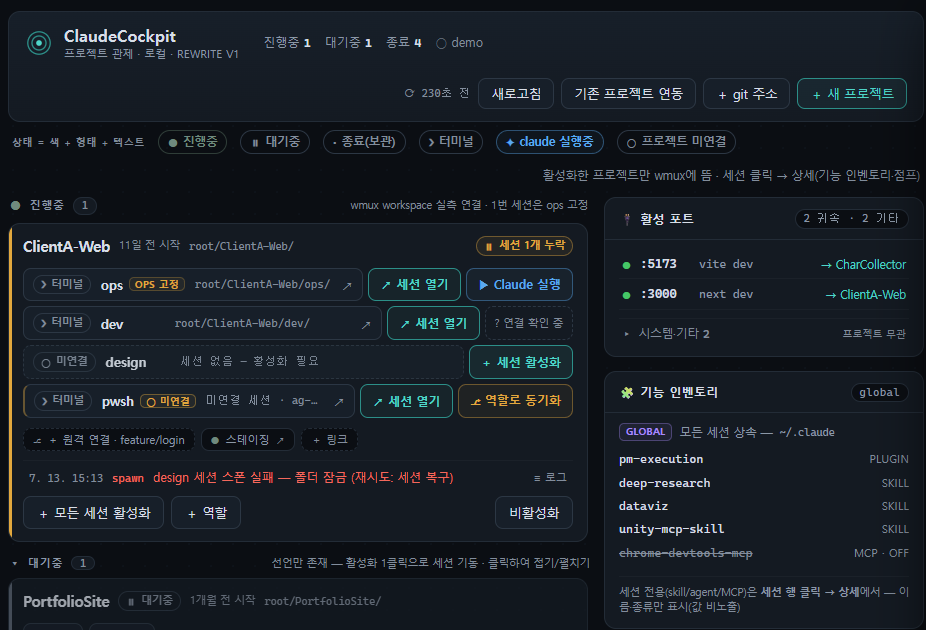
          

          

            <h3>ClaudeCockpit</h3>
            
여러 프로젝트의 Claude Code 세션을 한 화면에서 관리·모니터링하는 로컬 대시보드입니다. 세션 상태 확인과 빠른 전환을 지원합니다.

            
Claude CodeNode.jswmuxv0.3

            

              <a class="btn" href="project/ClaudeCockpit/ClaudeCockpit-v0.3.0.zip" target="_blank" rel="noopener">다운로드</a>
              <a class="btn" href="https://github.com/ReDocu/ClaudeCodeTemplate" target="_blank" rel="noopener">GitHub</a>
              <a class="btn" href="project/ClaudeCockpit/Tech_document.html" target="_blank" rel="noopener">기술문서</a>
            

          

        </article>
        <article class="portfolio-card">
          

            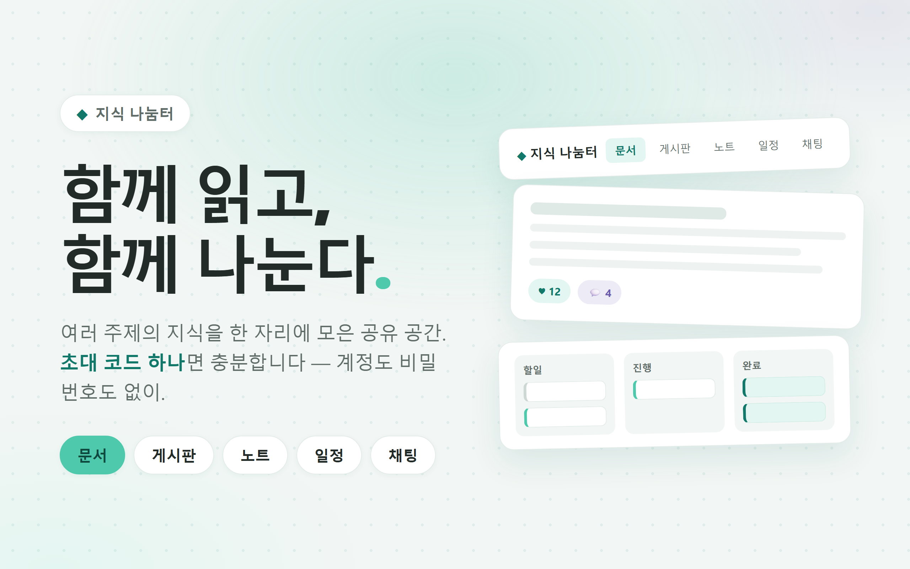
          

          

            <h3>지식 나눔터</h3>
            
문서·게시판·노트·일정·채팅을 한 자리에 모아 함께 읽고 나누는 지식 공유 공간입니다. 리서치 문서와 학습 자료를 자동 색인해 함께 관리합니다.

            
Node.jsVercelUpstash Redis운영중

            

              <a class="btn" href="https://company-process.vercel.app/" target="_blank" rel="noopener">방문</a>
              <a class="btn" href="https://github.com/ReDocu/CompanyProcess" target="_blank" rel="noopener">GitHub</a>
              <a class="btn" href="https://github.com/ReDocu/CompanyProcess#readme" target="_blank" rel="noopener">기술문서</a>
            

          

        </article>
        <article class="portfolio-card">
          

            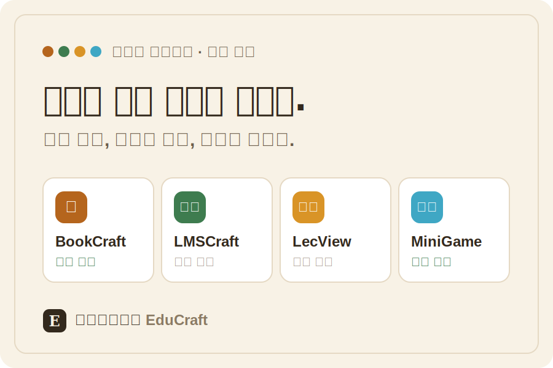
          

          

            <h3>EduCraft</h3>
            
학습 플랫폼. 책 제작 플랫폼 BookCraft, 학습 관리 LMSCraft, 강의 탐색·리뷰 LecView, 미니게임 네 개의 공방을 사용하는 단일 Next.js 앱입니다.

            
Next.jsSupabase모노레포Vercel

            

              <a class="btn" href="http://www.eqment.store/" target="_blank" rel="noopener">방문</a>
              <a class="btn" href="https://github.com/ReDocu/EduCraft" target="_blank" rel="noopener">GitHub</a>
              <a class="btn" href="https://github.com/ReDocu/CompanyProcess#readme" target="_blank" rel="noopener">기술문서</a>
            

          

        </article>
        <article class="portfolio-card">
          

            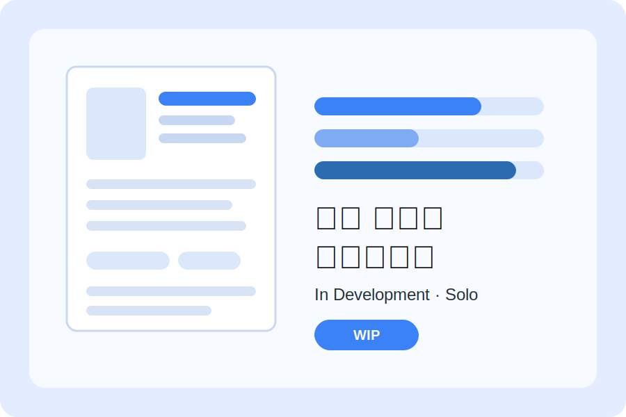
          

          

            <h3>가상 이력서 시뮬레이션</h3>
            
가상 인물의 이력서를 만들고 평가해 보는 시뮬레이션 프로젝트입니다. 개인 프로젝트로 정식 출시를 목표로 개발하고 있습니다.

            
개발중출시목적개인GitHub

            

              <a class="btn" href="https://github.com/ReDocu/ResumeAnalyze" target="_blank" rel="noopener">GitHub 바로가기</a>
            

          

        </article>
        <article class="portfolio-card">
          

            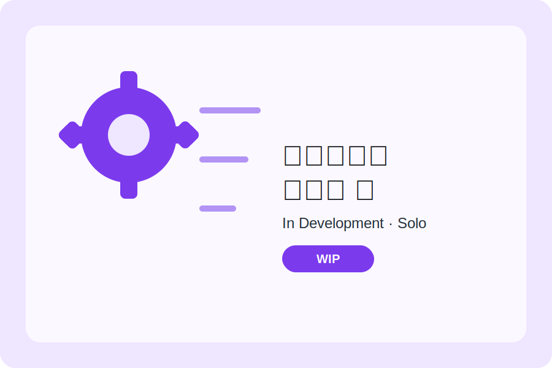
          

          

            <h3>소프트웨어 자동화 툴 프로그램</h3>
            
반복되는 작업 과정을 자동화하는 툴 프로그램입니다. 개인 프로젝트로 정식 출시를 목표로 개발하고 있습니다.

            
개발중출시목적개인GitHub

            

              <a class="btn" href="https://github.com/ReDocu/ProcessingAuto" target="_blank" rel="noopener">GitHub 바로가기</a>
            

          

        </article>
        <article class="portfolio-card">
          

            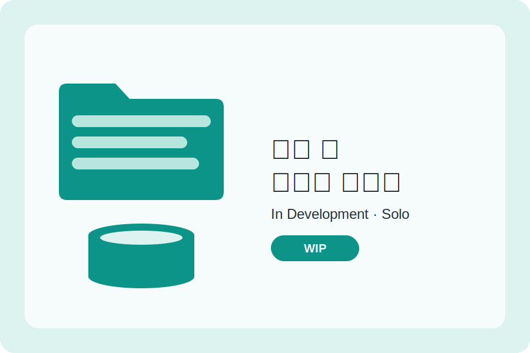
          

          

            <h3>에셋 및 데이터 관리자</h3>
            
프로젝트의 에셋과 데이터를 한곳에서 정리·관리하는 도구입니다. 개인 프로젝트로 정식 출시를 목표로 개발하고 있습니다.

            
개발중출시목적개인GitHub

            

              <a class="btn" href="https://github.com/ReDocu/AssetManager" target="_blank" rel="noopener">GitHub 바로가기</a>
            

          

        </article>
        <article class="portfolio-card">
          

            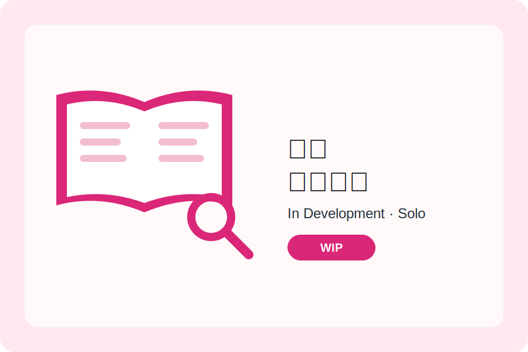
          

          

            <h3>사전 프로젝트</h3>
            
용어와 지식을 모아 정리하고 검색해 보는 사전 프로젝트입니다. 개인 프로젝트로 정식 출시를 목표로 개발하고 있습니다.

            
개발중출시목적개인GitHub

            

              <a class="btn" href="https://github.com/ReDocu/DictionaryProject" target="_blank" rel="noopener">GitHub 바로가기</a>
            

          

        </article>
      

      <button class="slider-arrow slider-arrow--right" type="button" aria-label="다음 카드"><svg viewBox="0 0 24 24" aria-hidden="true"><path d="M9.5 5.5L16 12l-6.5 6.5" fill="none" stroke="currentColor" stroke-width="2.4" stroke-linecap="round" stroke-linejoin="round"/></svg></button>
    

  

</section>

<!-- Section 02 : 게임 소프트웨어 -->
<section class="section portfolio-section" id="games">
  

    

      
Section 02

      <h2>게임 소프트웨어</h2>
      
직접 설계하고 구현한 게임과 게임 개발 프레임워크 모음입니다.

    

    

      <button class="slider-arrow slider-arrow--left" type="button" aria-label="이전 카드"><svg viewBox="0 0 24 24" aria-hidden="true"><path d="M14.5 5.5L8 12l6.5 6.5" fill="none" stroke="currentColor" stroke-width="2.4" stroke-linecap="round" stroke-linejoin="round"/></svg></button>
      

        <article class="portfolio-card">
          

            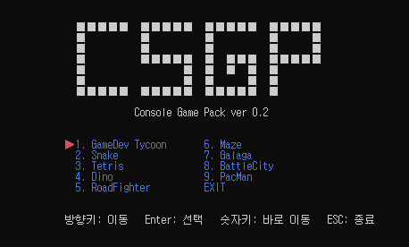
          

          

            <h3>CSGP 게임 개발 C언어 학습용 프레임워크</h3>
            
Win32 API 기반 C++ 콘솔 게임 프레임워크. 엔진과 콘텐츠를 분리한 구조로 9종의 콘솔 게임을 단계적으로 개발하며 학습하는 프로젝트입니다.

            
C++Win32 API콘솔게임교육완료

            

              <a class="btn" href="project/CSGP/CSGP.zip" target="_blank" rel="noopener">다운로드</a>
              <a class="btn" href="https://github.com/ReDocu/CSGPProject" target="_blank" rel="noopener">GitHub</a>
              <a class="btn" href="project/CSGP/study_doc/index.html" target="_blank" rel="noopener">학습문서</a>
            

          

        </article>
        <article class="portfolio-card">
          

            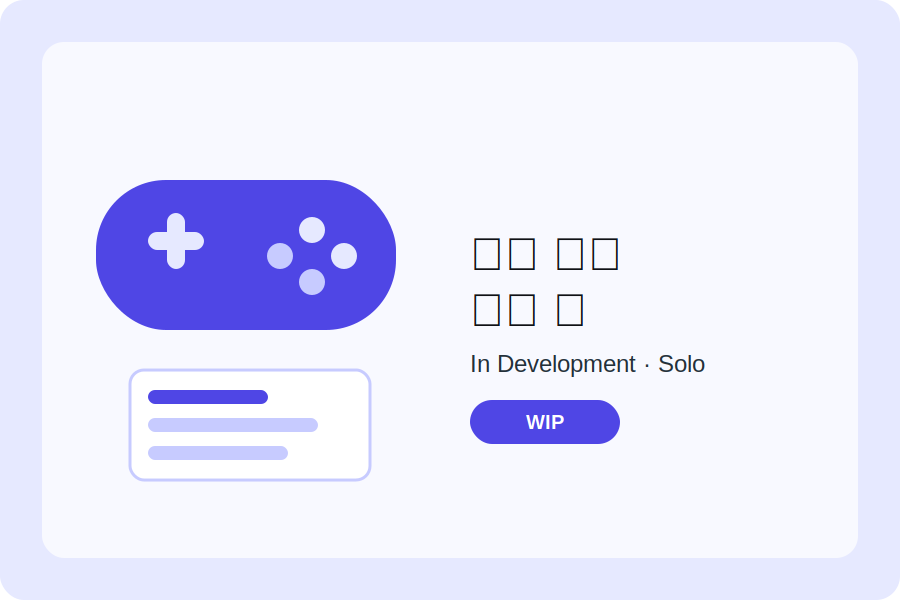
          

          

            <h3>게임 개발 운영 툴</h3>
            
게임 개발과 라이브 운영을 돕는 자동화 툴입니다. 개인 프로젝트로 정식 출시를 목표로 개발하고 있습니다.

            
개발중출시목적개인GitHub

            

              <a class="btn" href="https://github.com/ReDocu/GameDevAuto" target="_blank" rel="noopener">GitHub 바로가기</a>
            

          

        </article>
        <article class="portfolio-card">
          

            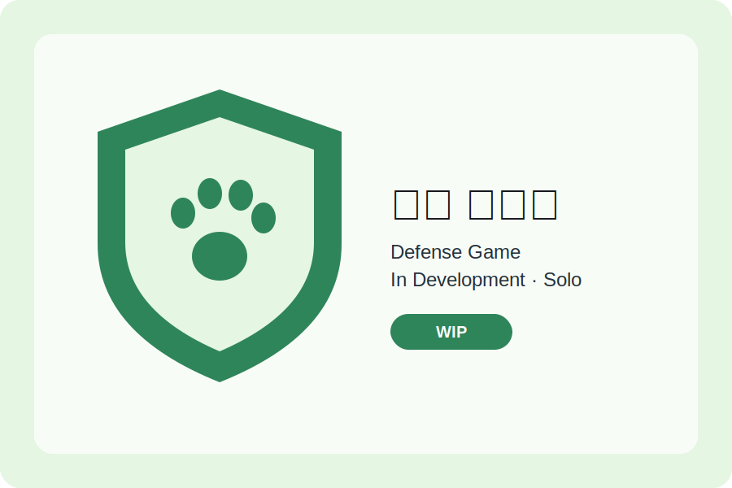
          

          

            <h3>동물 수호대</h3>
            
동물들을 지켜내는 디펜스 게임입니다. 개인 프로젝트로 정식 출시를 목표로 개발하고 있습니다.

            
개발중출시목적개인GitHub

            

              <a class="btn" href="https://github.com/ReDocu/AnimalDeffence" target="_blank" rel="noopener">GitHub 바로가기</a>
            

          

        </article>
        <article class="portfolio-card">
          

            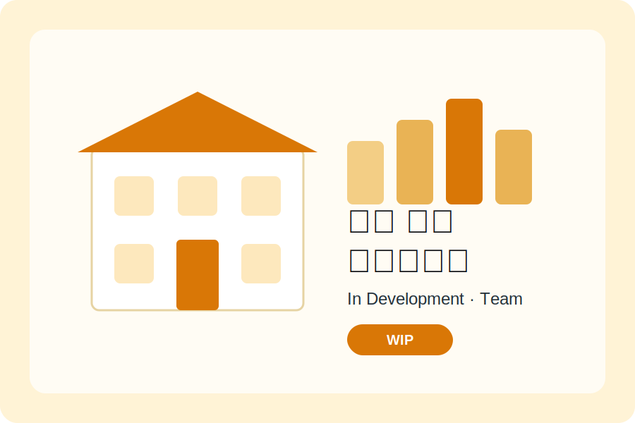
          

          

            <h3>학원 운영 시뮬레이션</h3>
            
학원을 운영하며 커리큘럼과 수강생을 관리하는 경영 시뮬레이션 게임입니다. 팀 프로젝트로 정식 출시를 목표로 개발하고 있습니다.

            
개발중출시목적팀GitHub

            

              <a class="btn" href="https://github.com/ReDocu/Project_Academy_Ops" target="_blank" rel="noopener">GitHub 바로가기</a>
            

          

        </article>
      

      <button class="slider-arrow slider-arrow--right" type="button" aria-label="다음 카드"><svg viewBox="0 0 24 24" aria-hidden="true"><path d="M9.5 5.5L16 12l-6.5 6.5" fill="none" stroke="currentColor" stroke-width="2.4" stroke-linecap="round" stroke-linejoin="round"/></svg></button>
    

  

</section>

<!-- Section 04 : 학원 교육 -->
<section class="section portfolio-section" id="academy">
  

    

      
Section 04

      <h2>학원 교육</h2>
      
학원 과정별로 배운 내용과 직접 만든 결과물을 정리했습니다.

    

    

      <button class="slider-arrow slider-arrow--left" type="button" aria-label="이전 카드"><svg viewBox="0 0 24 24" aria-hidden="true"><path d="M14.5 5.5L8 12l6.5 6.5" fill="none" stroke="currentColor" stroke-width="2.4" stroke-linecap="round" stroke-linejoin="round"/></svg></button>
      

        <article class="portfolio-card">
          

            
          

          

            <h3>게임 클라이언트/콘텐츠 개발 커리큘럼</h3>
            
디벨로퍼로켓(전 경일게임아카데미)

            
2019-09-02 ~ 2020-03-23

            
C/C++ 콘솔 → WinAPI 프레임워크 → Unity 엔진 순서로 게임 클라이언트 개발을 배우고, 단계마다 슈팅·SRPG·턴제 전략 게임을 직접 제작했습니다.

            
C/C++WinAPIUnity게임 개발

            

              <a class="btn" href="/Academy/Kyungil_Academy" target="_blank" rel="noopener">상세문서</a>
              <a class="btn" href="https://github.com/ReDocu/KYGameAcademy" target="_blank" rel="noopener">Github</a>
              <a class="btn" href="/Academy/KYGameAcademy/학습정리.html" target="_blank" rel="noopener">학습문서</a>
            

          

        </article>
        <article class="portfolio-card">
          

            
          

          

            <h3>비전 기반 AI 모델 생성 커리큘럼</h3>
            
MBC컴퓨터아카데미(전 국제컴퓨터아트학원) 

            
2023-09-13 ~ 2024-05-08 

            
Python 게임 제작에서 시작해 데이터 분석과 CNN 딥러닝, Object Detection 라벨링을 거쳐, 학습시킨 모델을 실시간 CCTV 웹 서비스로 배포했습니다.

            
PythonPandasTensorFlowFlask

            

              <a class="btn" href="/Academy/MBC_Academy" target="_blank" rel="noopener">상세문서</a>
              <a class="btn" href="/Academy/MBCAcademy/학습정리.html" target="_blank" rel="noopener">학습문서</a>
            

          

        </article>
        <article class="portfolio-card">
          

            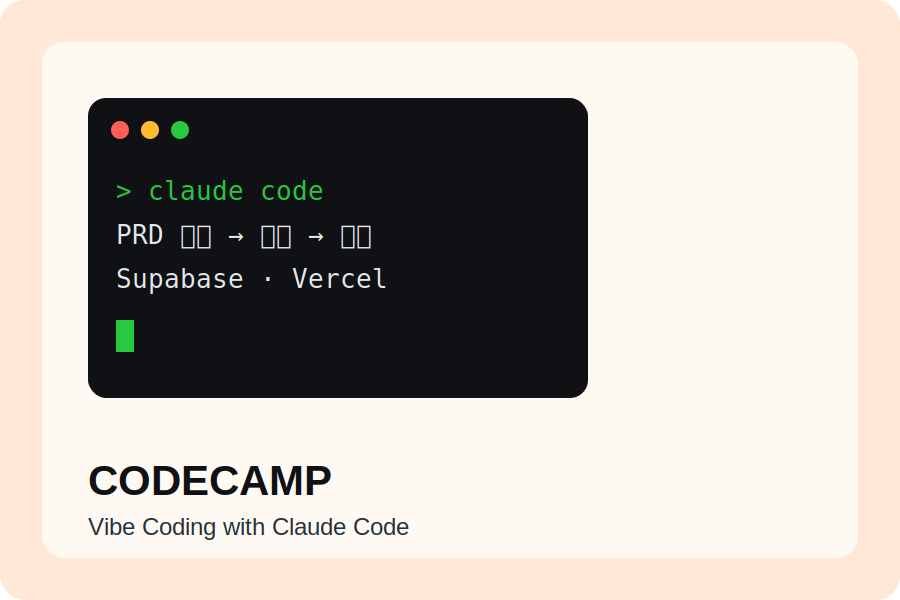
          

          

            <h3>웹 기반 바이브 코딩 커리큘럼</h3>
            
코드캠프(딩코)

            
2026-06-29 ~ 2026-09-11

            
Claude Code 중심의 바이브 코딩 과정. PRD 문서 작성부터 Supabase·Vercel 배포까지 익히며 소개 페이지와 미니 노션 웹서비스를 제작하고 있습니다.

            
Claude CodeSupabaseVercel진행중

            

              <a class="btn" href="/Academy/CodeCamp_Academy" target="_blank" rel="noopener">체험하기</a>
              <a class="btn" href="https://github.com/ReDocu/Sesac_CC_ClaudeCode" target="_blank" rel="noopener">Github</a>
            

          

        </article>
      

      <button class="slider-arrow slider-arrow--right" type="button" aria-label="다음 카드"><svg viewBox="0 0 24 24" aria-hidden="true"><path d="M9.5 5.5L16 12l-6.5 6.5" fill="none" stroke="currentColor" stroke-width="2.4" stroke-linecap="round" stroke-linejoin="round"/></svg></button>
    

  

</section>

<!-- Contact Us -->
<section class="section section--contact" id="contact">
  

    

      
Contact

      <h2>Contact Us</h2>
      
채용 제안과 헤드헌팅, 강의·교육 제안, 프로젝트 협업, 만든 도구에 대한 피드백까지 모두 환영합니다. 문의 폼을 남겨 주시면 가장 빠르게 확인합니다.

    

    

      

        <h3 class="contact-primary__title">문의 폼 남기기</h3>
        

          문의 유형을 고르시면 그에 필요한 항목만 보여 드립니다.
          구글 로그인 없이 바로 작성할 수 있고, 1~2분이면 충분합니다.
        

        
        
        
        
        
        

          
          <a class="btn" href="{{ site.contact_form_url }}" target="_blank" rel="noopener">문의 폼 작성하기</a>
          
          
          <a class="btn btn--ghost" href="{{ site.contact_form_url_en }}" target="_blank" rel="noopener" hreflang="en" lang="en">Contact form (English)</a>
          
        

        
        문의 폼 준비 중
        
        
보통 1~2일 안에 회신드립니다.

      

      

        

          
Email

          <a href="mailto:{{ site.contact_email }}">{{ site.contact_email }}</a>
        

        

          
채널

          

            <a class="btn btn--ghost" href="https://github.com/redocu" target="_blank" rel="noopener">GitHub</a>
            <a class="btn btn--ghost" href="/data/포트폴리오.pdf" target="_blank" rel="noopener">포트폴리오 PDF</a>
          

        

      

    

  

</section>
